<!-- #Title -->
# Human tracking dataset captured by drone.
## Introduction
* We have captured 500 videos by drone in various environment for multi object tracking task. Images were extracted from 30 frame per second video at different rate for training and test purposes. All extracted images are annotated by human with various properties such as occlusion, re-identification, visibility, pose, image truncation.


<p align='center'>
    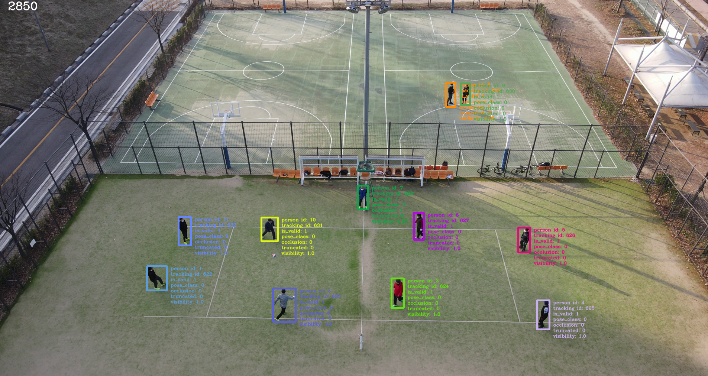
    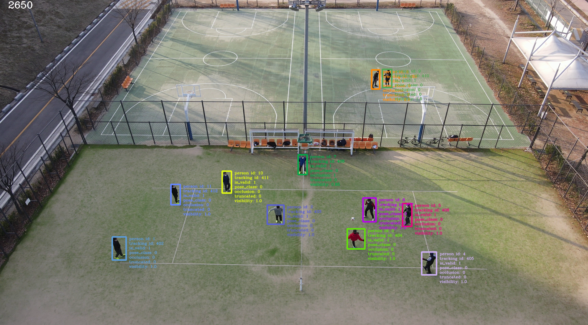
</p>

## Label format
 * Figure below is the example of ground truth file.

<p align='center'>
    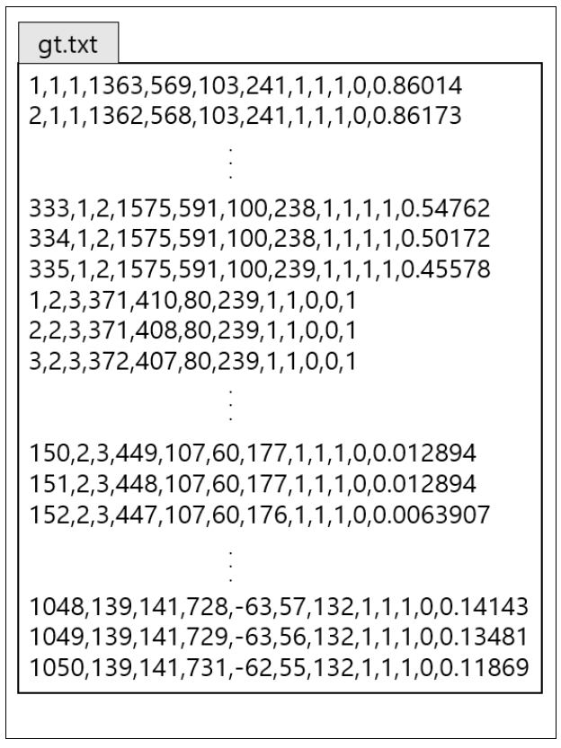
</p>

| Position | 1            | 2               | 3                 | 4              | 5              | 6         | 7          | 8        | 9          | 10        | 11        | 12         |
|----------|--------------|-----------------|-------------------|----------------|----------------|-----------|------------|----------|------------|-----------|-----------|------------|
|          | frame_number | person_id_index | tracking_id_index | box_top_left_x | box_top_left_y | box_width | box_height | is_valid | pose_class | occlusion | truncated | visibility |

## Description of properties

| Key            | Value type  | Description                                                                                       |
|----------------|-------------|---------------------------------------------------------------------------------------------------|
| frame_number   | INT         | Image frame number                                |
| person_id      | INT         | Unique number assinged to person in the sequence (i.e., same person in the sequence will have same number regardeless of appear/disapper)   |
| tracking_id    | INT         | Unique number assigned to track of person (i.e., when same person disapeared and appeared again in the sequence, this number will be different) |
| box_top_left_x | INT         | X coordinate of top left corner                                                                              |
| box_top_left_y | INT         | Y coordinate of top left corner                                                                               |
| box_width      | INT         | box width                                                                                          |
| box_height     | INT         | box height                                                                                          |
| is_valid       | INT (0/1)   | 0 : invalud instance (e.g., human in the picture), 1 : valid instance                                                   |
| pose_class     | INT (0/1/2) | 0 : General pose, 1 : Sitting, 2 : Waving hands                                                             |
| occlusion      | INT (0/1)   | 0 : occlusion , 1 : no occlusion                                                                  |
| truncated      | INT (0/1)   | 0 : truncated , 1 : no truncated                                                                  |
| visibility     | FLOAT       | area of actual visible area in pixel / area of object size in the image predicted by human labeler  |


## Download 

- [Download](https://uvify.sharepoint.com/:f:/s/research/EtBbHTxuaLJMlQM0aIkIF9UBnN2hd1nQ4ZLlkRIRTX4z5g?e=NZZeeZ)
  - Train images were extracted from video taken from drone at 1 frame per second.
    - This is for model training.
  - Test images were extracted from video taken from drone at 3 frame per second.
    - This is for evaluating the trained model.

## Directory Structure
<pre>
 [root path]/
 └──[test or train]/                  
    └──[seqence_(sequence number)]/
       ├──(sequence_number).txt     <--- ground truth
       └──[images]/
          └──(frame_number).png     <--- image
</pre>


## Tools

### Visualizer

``` ruby
 python3 visualize_data.py --dir=[root_dir_path] --type=[train or test] --seq=[sequence number( 450 <= test < 500 ,  0 <= train < 450)]
```

<pre>
key 'q' 'esc' : exit program
key 'n' '->'  : next frame
key 'p' '<-'  : prev frame
</pre>

## Data Distribution

### Dataset 
|     | Number of images | Description                              | 
|-----|------------------|------------------------------------------|
|train| 13,500            | Dataset used during the learning process |
|test | 4,500             | Dataset used only to assess performance  |
|total| 18,000            |                                          |


### Drone camera angle 
|        | Number of images | Description                                                                            | 
|--------|------------------|----------------------------------------------------------------------------------------|
|general | 14,370            | Dataset taken when the angle of the drone camera to the ground is between 10~60 degrees|
|top     | 3,630             | Dataset taken when the angle of the drone camera to the ground is around 90 degrees    |
|total   | 18,000            |                                                                                        |


### Weather
|        | Number of images | Description                                 | 
|--------|------------------|---------------------------------------------|
|sunny   | 10,320            | Dataset taken on a sunny day                |
|cloudy  | 7,680             | Dataset taken on a rainy or cloudy day      |
|total   | 18,000            |                                             |

### Filming location
|                | Number of images | Description                                                                         | 
|----------------|------------------|-------------------------------------------------------------------------------------|
|general         | 9,000            | Dataset taken from common roads such as side walk and asphalt                       |
|green           | 6,900             | Dataset taken in natural environments                                               |
|play ground     | 2,100            | Dataset taken from outdoor sports venues such as tennis courts and basketball courts|
|total           | 18,000            |                                                                                     |


<!-- <p align='center'>
    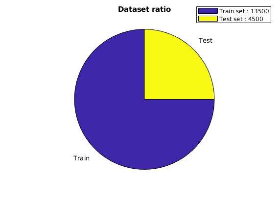
    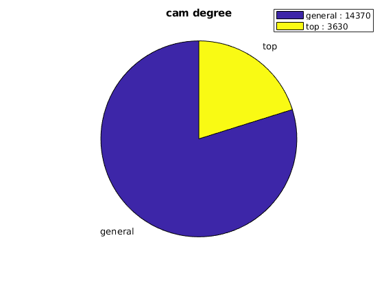
    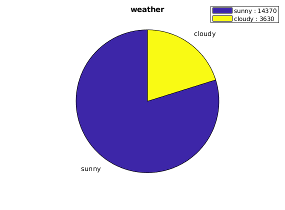
    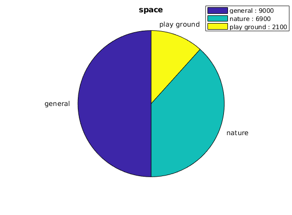    
</p> -->

## Class Distribution

### Human pose class-
|           | Number of objects| Description                                                                           | 
|-----------|------------------|---------------------------------------------------------------------------------------|
|general    | 134,328           | Objects(people) with comman posture, such as walking or standing                      |
|sitting    | 9,598             | Objects(people) with sitting posutre                                                  |
|waving hand| 542              | Object(people) waving hands                                                           |
|total      | 144,468           |                                                                                       |


### Occlusion 
|            | Number of objects| Description                                                                          | 
|------------|------------------|--------------------------------------------------------------------------------------|
|occluded    | 49,258            | Objects that are obscured by other objects within the image                          |
|not occluded| 95,210            | Objects that appear completely without occlusion within the image                    |
|total       | 144,468           |                                                                                      |


### Truncation
|             | Number of objects| Description                                                                          | 
|-------------|------------------|--------------------------------------------------------------------------------------|
|truncated    | 10,508            | Objects whose part is out of the image                                               |
|not truncated| 133,960           | Objects that appear completely without truncation within the image                   |
|total        | 144,468           |                                                                                      |


<!-- <p align='center'>
    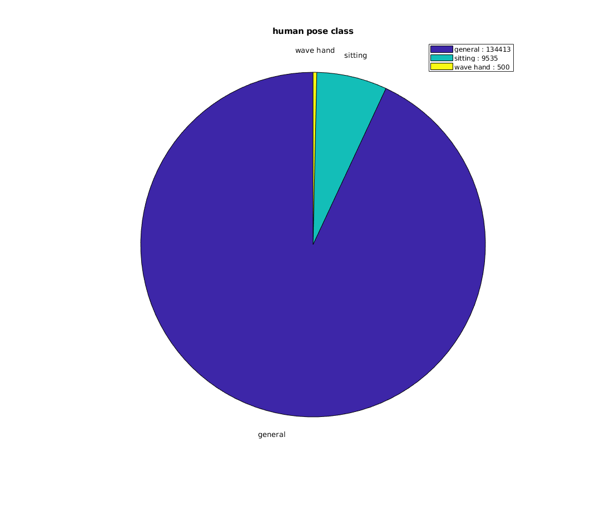
    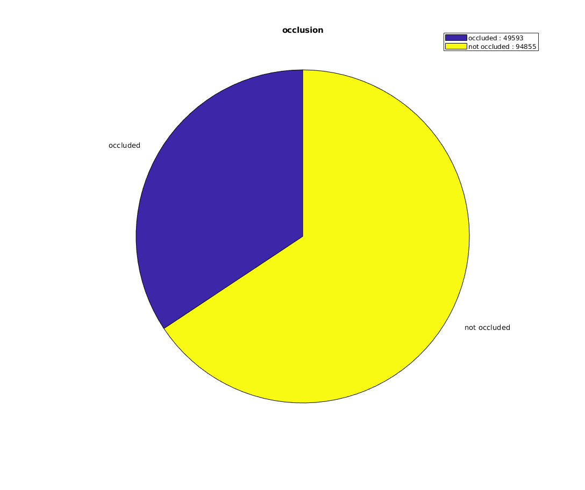
    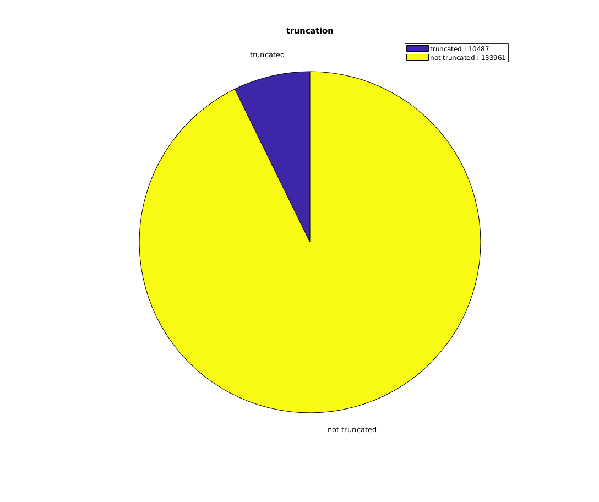
</p> -->


## Data Example
 * Images below are example images from dataset.
<p align='center'>
    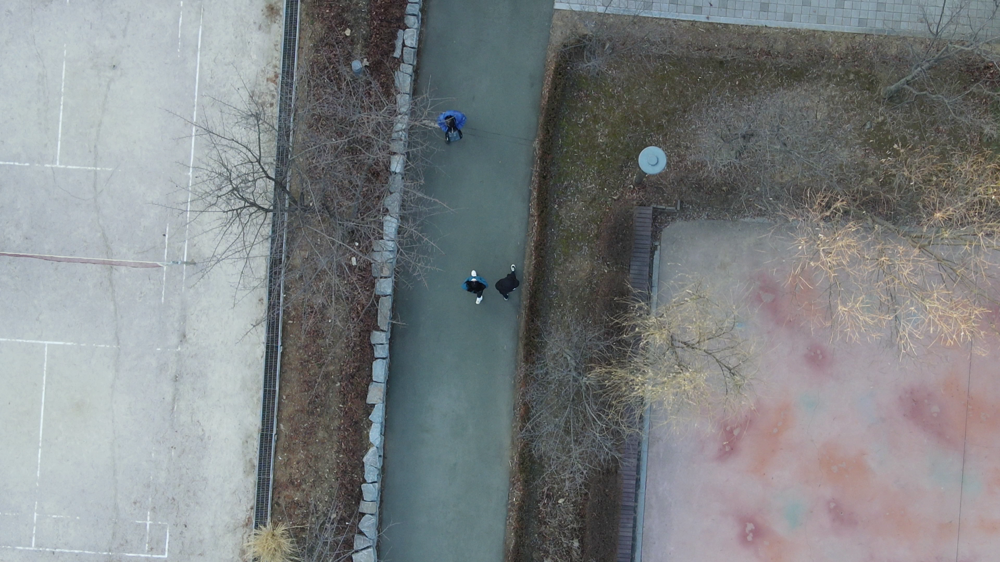
    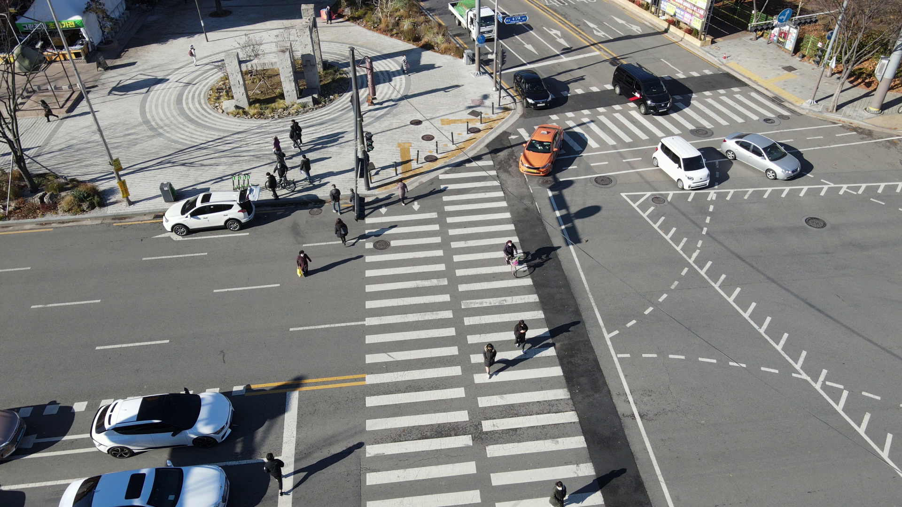
</p>

<p align='center'>
    
    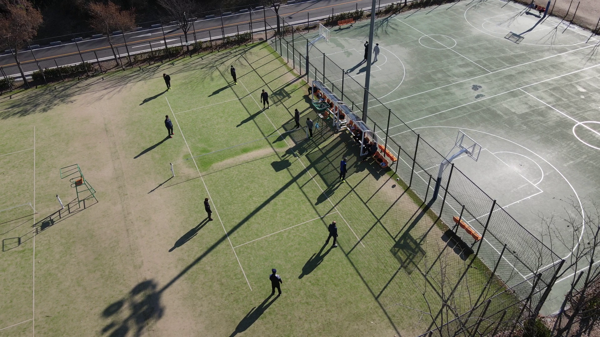
</p>

## Acknowledgement

이 데이터는 2021년도 정부(과학기술정보통신부)의 재원으로 정보통신기획평가원의 지원을 받아 수행된 연구의 결과물임 (No.171125972, 인명 구조용 드론을 위한 영상/음성 인지 기술 개발)

This work was supported by Institute of Information & communications Technology Planning & Evaluation (IITP) grant funded by the Korea government(MSIT) (No.171125972, Audio-Visual Perception for Autonomous Rescue Drones)