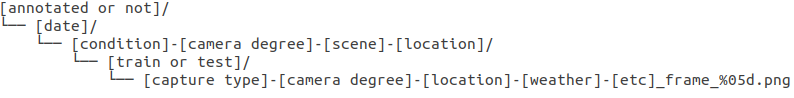
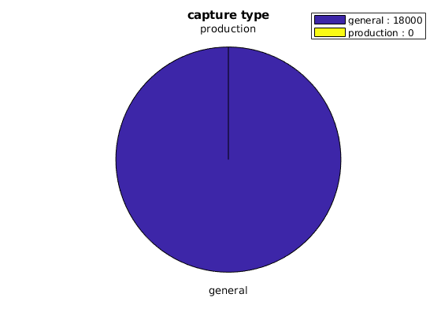

# drone_tracking_dataset

## Human tracking dataset captured by drone.

    
    

## Dataset Download

- [Train set](http://www.naver.com)
- [Test set](http://www.google.com)

## Data Structure

    

## Data Statistics

    
    
    
        

### total : 18000 (500 clip)
### train : 13500 (450 clip)
### test  : 4500  (50 clip)

### film general : 18000
### gen view : 14370 
### top view : 3630
### sunny : 10320
### cloudy : 7680
### space-general : 9000
### space-green : 6900
### space-play : 2100

